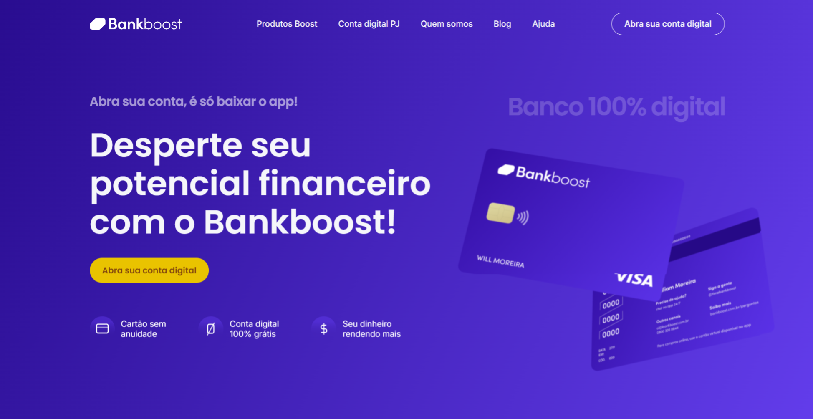

# Projeto Bankboost

Mais um projeto saindo do forno! 🔥

O Bankboost é uma página de cartão de crédito, desenvolvida com HTML, CSS e JavaScript. Destaque para os cartões flutuando na tela, que dão um toque especial ao design, graças ao keyframes do CSS. Além disso, a página conta com um slider de depoimentos de clientes feito com JavaScript e algumas animações suaves que tornam a navegação mais agradável.

O Bankboost é responsivo, então fica ótimo em qualquer tela! 😉

Mais um módulo do Codeboost concluído com sucesso! ✅

## Tecnologias Utilizadas
- HTML
- CSS
- SASS
- JavaScript

## Dê play no projeto!

[Confira aqui!](https://iana-ribeiro.github.io/bankboost/)

## Contato

**E-mail**: ianaribeiro.tech@gmail.com

Ou entre em contato pelo [LinkedIn](https://www.linkedin.com/in/iana-ribeiro/).
